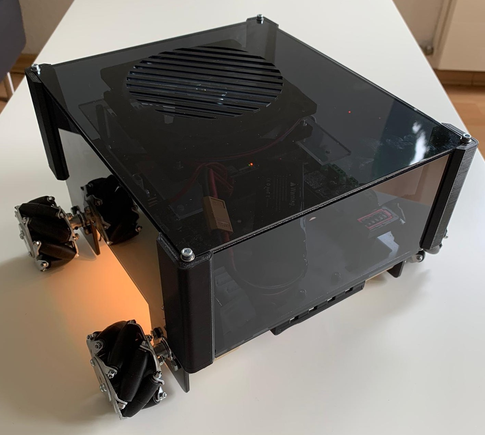

# MCB-Mobil
A selfmade RC car with mecanuum wheels.

## Important Notes
The Software written for the STM microcontroller is for the [STM32Workbench](https://www.st.com/en/development-tools/sw4stm32.html) IDE.
The Software written for the Arduino is made in [Arduino](https://www.arduino.cc/en/software)

The controller is on version 2.0. The old files of version 1.0 are not on this github.
See "Controller Changelog" or the documentation below for more information.

[First Documentation v1.0](https://github.com/MXACE/MCB-Mobil/tree/master/Documentation/MCB_Mobil_Doku_LarsPeter_MarcoStauber.pdf)

[Second Documentation (Controller v2.0)](https://github.com/MXACE/MCB-Mobil/tree/master/Documentation/Doku_controller.pdf)

## Controller Changelog
v2.0
- Added BMG250 Sensor.
- Removed OLED Connector.
- Added OLED Screen COM connector.
- Changed microcontroller from STM32F107VC to STM32F405RGT6.
- Removed connection for Lora Breakout Board.
- Added RN2483 Lora Module directly on PCB.
- Replaced 20pin JTAG conntector with 5 Pin SWD connector and TagConnect pads.
- Removed onboard STLINK and it's USB Connector.
- Added Powerswitch between Battery and USB.
- Several layout changes.

## Important Files:

Schematics of the Car, Controller and the Lora Breakoutboard can be found [here](https://github.com/MXACE/MCB-Mobil/tree/master/All_Schematics)

### Car:
- [PCB Files](https://github.com/MXACE/MCB-Mobil/tree/master/Car/CAD/v1.0/Chassisv1.0)
- [3D Printed Casing Parts (Scheinwerfer & Plexiglashalter)](https://github.com/MXACE/MCB-Mobil/tree/master/Car/3d%20modell/3dprint)
- [Software for STM32F107](https://github.com/MXACE/MCB-Mobil/tree/master/Car/SW)
- [Software for Arduino Nano](https://github.com/MXACE/MCB-Mobil/tree/master/Car/SW_ARD)
- [BOM](https://github.com/MXACE/MCB-Mobil/tree/master/Car/Assembly)

### Controller:
- [PCB Files](https://github.com/MXACE/MCB-Mobil/tree/master/Controller/PCB)
- [3D Printed Casing Parts](https://github.com/MXACE/MCB-Mobil/tree/master/Controller/Assembly)
- [Software for STM32F405](https://github.com/MXACE/MCB-Mobil/tree/master/Controller/SW)
- [BOM](https://github.com/MXACE/MCB-Mobil/tree/master/Controller/BOM)

### RN2483 Lora Breakout Module
- [PCB Files](https://github.com/MXACE/MCB-Mobil/tree/master/Funk/CAD/v1.0/PCB_Project)
- [BOM](https://github.com/MXACE/MCB-Mobil/tree/master/Funk/Assembly)
